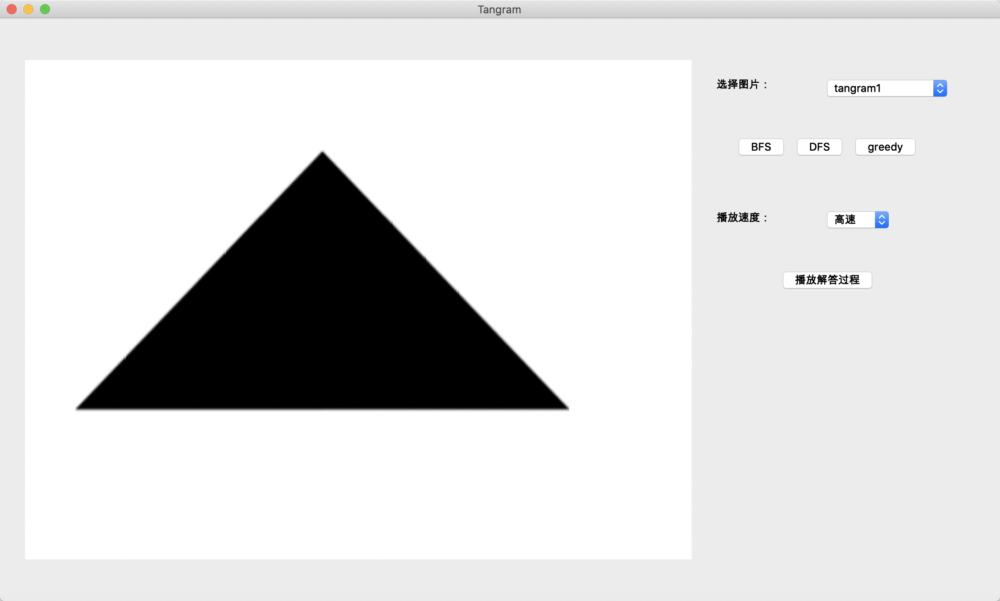

# Tangram-Pieces-Matching-and-Recognition-demo

+ Suport BFS,DFS and greedy algorithm for solving the 7 Pieces tangram problem

# environment

+ python3
+ opencv-python                      4.5.1.48
+ mac
+ QtPy                               1.8.0

# run

```
python test.py # command
python ui_basic.py # ui
```



# reference

[tangram_solve](https://github.com/urkax/Tangram-solving-starting-from-image)